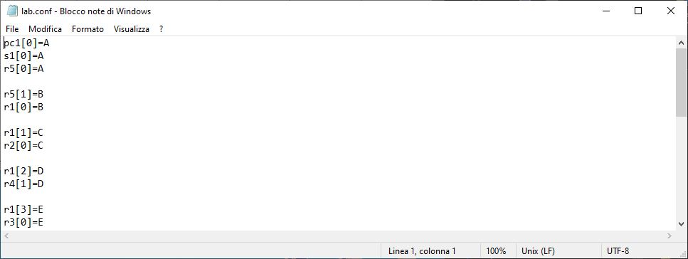
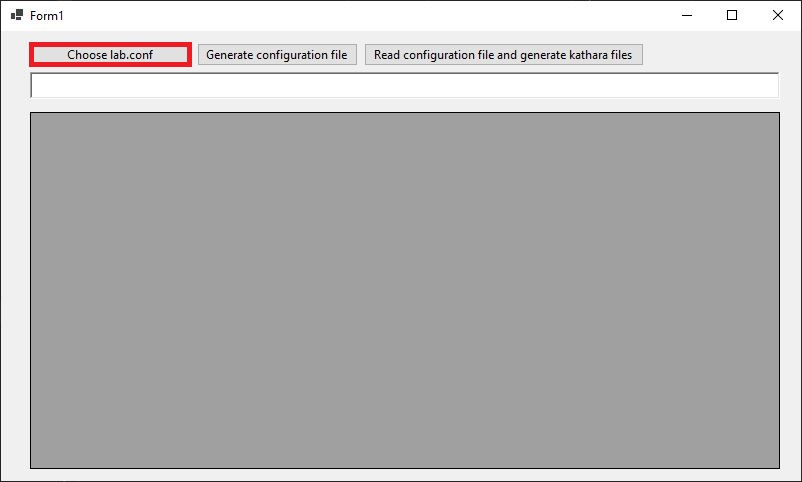
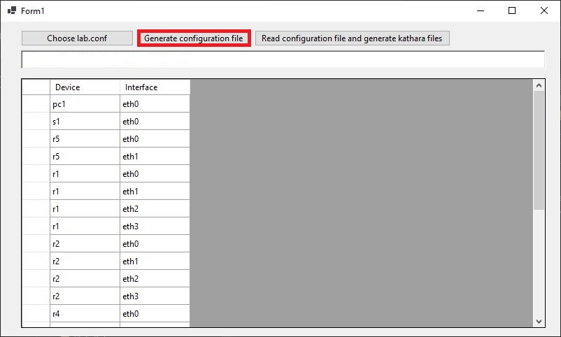
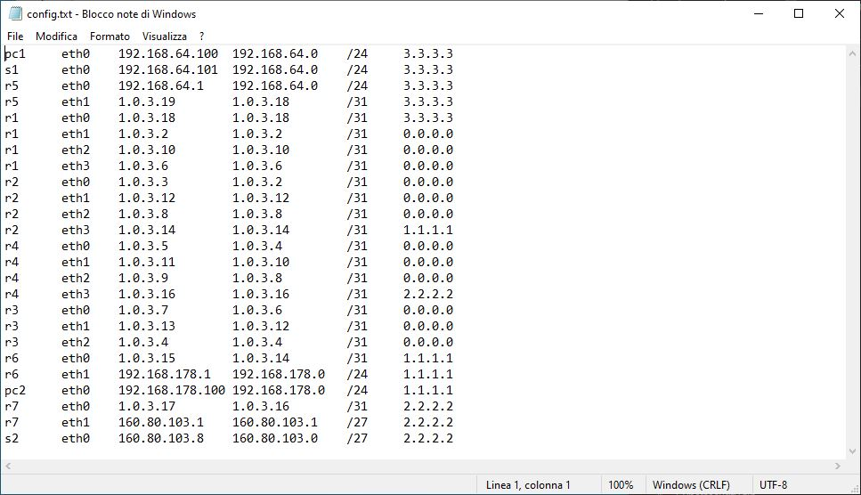
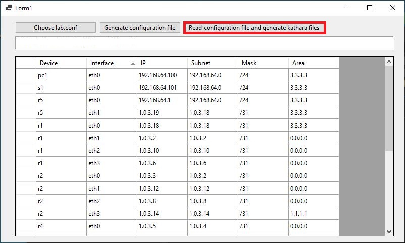
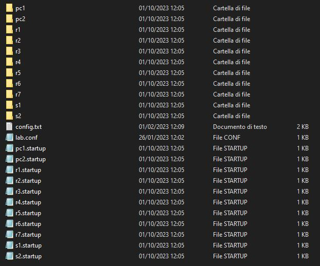

# KatharaAutoOSPF
Simple c# program to setup OSPF in kathara. It is useful for Netwrok Infrastructures exam in Cybersecurity course at Sapienza. There is no garauntee that the configuration generated by this program will work with kathara images other than the one provided in the Network Infrastructures course.

## Installation

Use the .exe file or run the source code. 
The .exe file is so big because it include all the modules needed to run it, so there is no need to install or download anything other than the .exe file.  

## Usage
First of all create the lab.conf file and write the topology of the network  

Start KatharaAutoOSPF and press the first button to locate the lab.conf   

Press the second file to generate the configuration file needed by the program   

The config file contains on each line the device name and interface, it is necessary to omplete the file by writing on each line ip, subnet, mask and area.   

Press the third button to generate the file needed to perform OSPF   

And this is the result   

